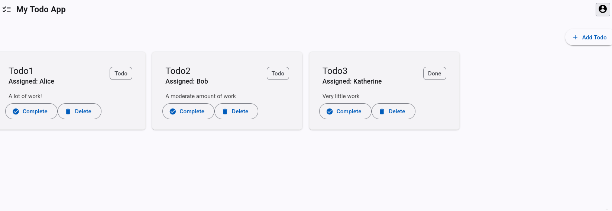
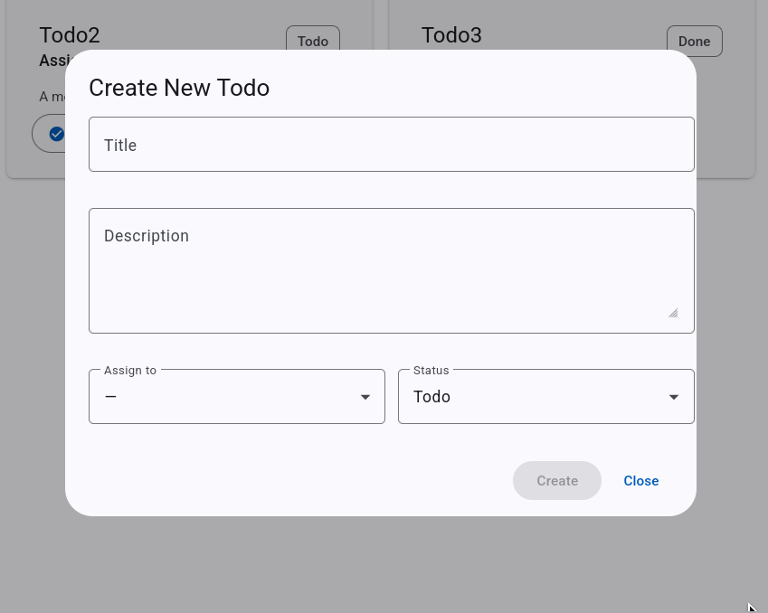
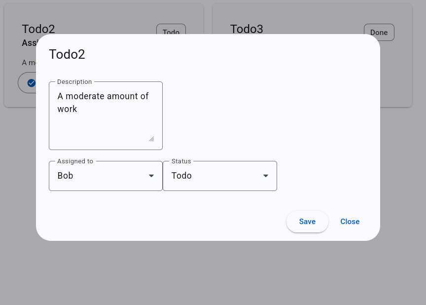

# TODO List App

A simple TodoList app built on **.NET 9 Web API** as the backend,
and **Angular 20** as the frontend with **Angular Material** for
styling.

## Features

- View create, update and delete todos.
- Each Todo has:
  - Title
  - Description
  - Author (hardcoded for this demonstration)
  - Assigned user
  - Status (`Todo`, `InProgress`, `Done`)
- Responsive UI built with Material
- Create and Edit dialogues as popups with form validation
- In-memory backend data (no external database)

## Setup

```sh
git clone https://github.com/KaeTahr/TODO_dotnet
cd TODO_dotnet
```

run the backend

```sh
cd TodoApi
dotnet restore
dotnet run
```

run the frontend

```sh
cd todo-frontend
npm install 
ng serve
```

Note: the program expects the backend to run in the default port
localhost:5293

By default the frontend runs on
localhost:4200

## Images



